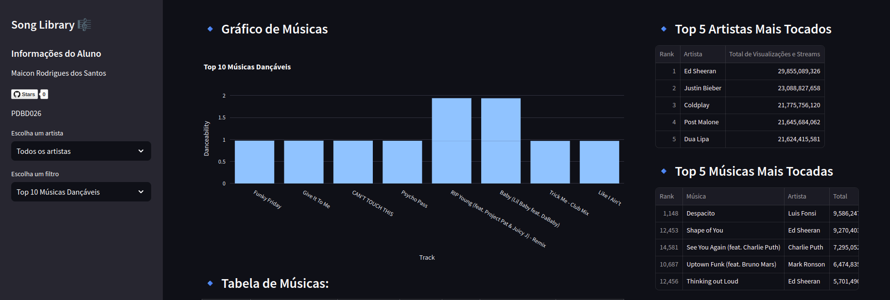

# projeto-desenvolve-desafio-python

# 🎶 **Song Library Dashboard** 🎵

## 📜 **Descrição do Projeto**

Bem-vindo ao **Song Library Dashboard**! Este projeto é um dashboard interativo desenvolvido para explorar uma biblioteca de músicas e visualizar informações detalhadas sobre as top músicas e artistas. Utilizando a poderosa combinação de **Streamlit**, **Plotly** e **Pandas**, o dashboard oferece uma experiência rica e dinâmica para os amantes da música. 🚀🎉

### Por que este projeto?
A ideia surgiu da necessidade de criar uma plataforma visualmente atraente e funcional para analisar músicas com base em diversas métricas, como popularidade, dançabilidade e mais. Nosso objetivo é facilitar a exploração de dados e proporcionar uma interface amigável e informativa. 🌟

## 📷 **Demonstração de Uso**

### Dashboard


### Veja ao vivo


### Funcionalidades:
- **Filtro de Artista**: Escolha um artista específico ou visualize todos os artistas.
- **Filtros Avançados**: Descubra as top músicas dançáveis, instrumentais, e muito mais!
- **Gráficos Interativos**: Visualize as estatísticas de músicas com gráficos dinâmicos.
- **Tabela de Músicas**: Confira detalhes das músicas mais tocadas, incluindo links para YouTube e Spotify.

## 🛠 **Tecnologias Utilizadas**

- **Python**: Linguagem de programação principal.
- **Streamlit**: Framework para criar aplicações web interativas.
- **Plotly**: Biblioteca para criar gráficos interativos e visualizações.
- **Pandas**: Biblioteca para manipulação e análise de dados.

## 📊 **Dados Originais**

Os dados são provenientes de um arquivo CSV contendo informações sobre músicas, incluindo:
- **Artista**: Nome do artista.
- **Título**: Nome da música.
- **Duração**: Duração da música em milissegundos.
- **Visualizações no YouTube**: Número total de visualizações no YouTube.
- **Streams no Spotify**: Número total de streams no Spotify.
- **Energia, Dançabilidade, Instrumentalidade, Plateia, Felicidade**: Métricas adicionais para análise das músicas.

## 🚀 **Como Executar o Projeto**

1. **Clone o Repositório**:
   ```bash
   git clone https://github.com/seu-usuario/song-library-dashboard.git
   ```
2. **Instale as Dependências**:
   ```bash
   cd song-library-dashboard
   pip install -r requirements.txt
   ```
3. **Execute o Dashboard**:
   ```bash
   streamlit run app.py
   ```
4. **Acesse o Dashboard**:
   Abra seu navegador e vá para `http://localhost:8501`.

## 📧 **Contato**

Para mais informações ou perguntas, sinta-se à vontade para entrar em contato!

- **Nome**: Maicon Rodrigues dos Santos
- **PDBD**: PDBD026
- **Email**: [maicon@example.com](mailto:maiconrdsantos88@gmail.com)
- **GitHub**: [mrdsantos](https://github.com/mrdsantos)